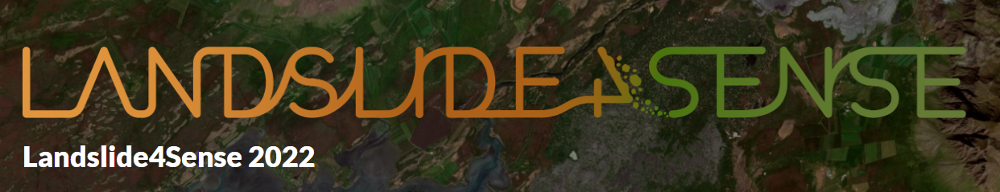

# LandSlide4Sense 2022 Baseline

</img>

Simple U-Net baseline for the [LandSlide4Sense 2022](https://www.iarai.ac.at/landslide4sense/) landslide detection challenge. This baseline uses the PyTorch Lightning, Kornia, and Segmentation Models PyTorch packages.

</img>

### Install Dependencies

```bash
pip install -r requirements.txt
```

### Train

```bash
python train.py --cfg conf/train.yaml
```

### Predict and Submit

```bash
python predict.py --predict_on val \
    --output_directory outputs \
    --device cuda \
    --log_dir logs/version_0
zip submission.zip outputs/*.h5
```
